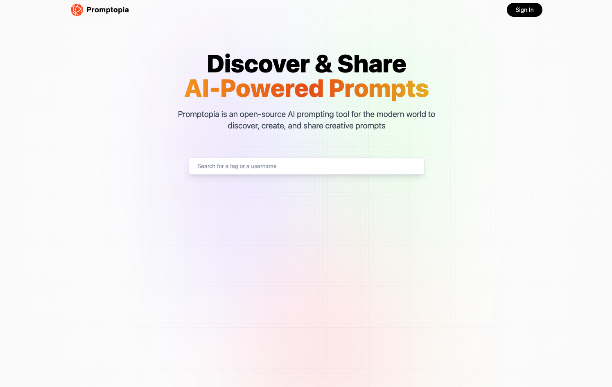
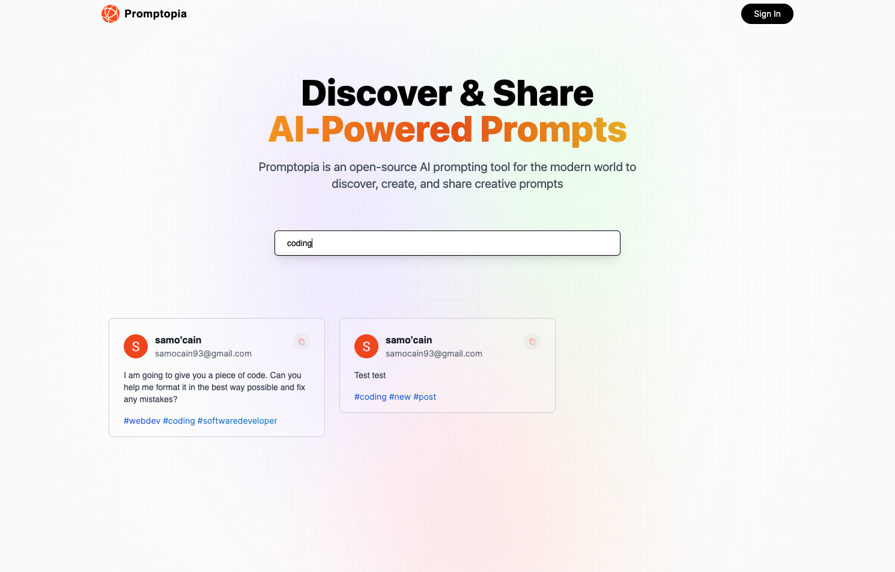
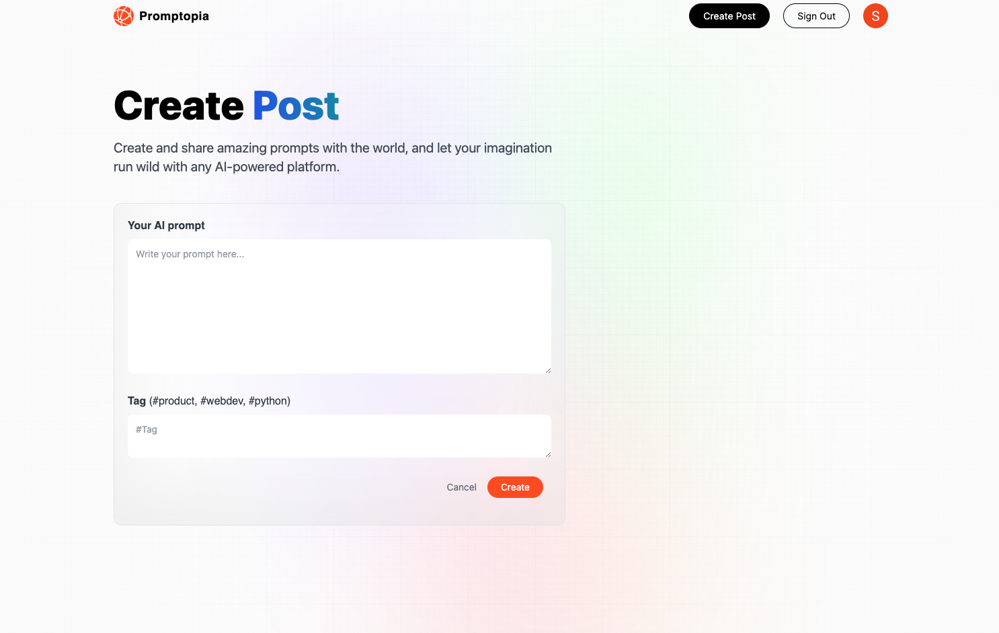
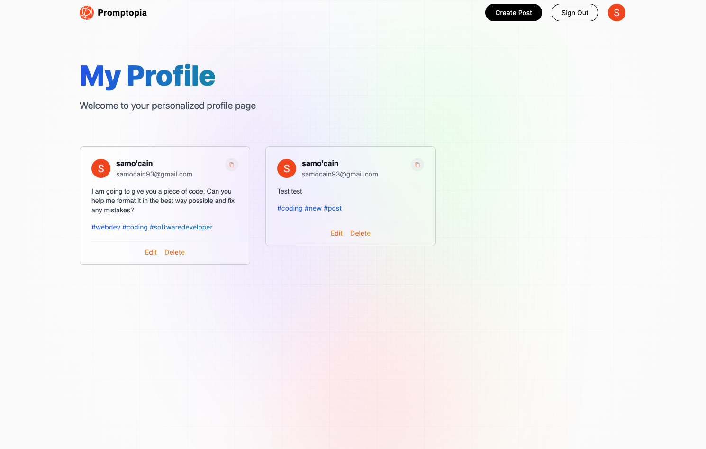

# Promptopia
A full stack Next.js application allowing users to create and share AI prompts with the world

## Description

This is a full stack application designed using various modern frameworks and tools such as Next.js, React, Tailwind CSS, Google Auth, MongoDB, and deployed with Vercel. The primary functionality is to allow users to create a profile, write and share creative AI prompts as we deal with an increasing presence of AI being used in both the personal and professional world. The application will contain a feed showing all the prompts created, a search bar to filter out prompts by hashtag or username, options to click a hashtag to see related posts, and view a user's profile. 

This was an exciting project to work on and learn more about Next.js and its powerful tools in creating modern and efficient web applications. 

## Table of Contents

- [Built Using](#built-using)
- [Screenshots](#screenshots)
- [Deployed Application](#deployed-application)
- [Usage](#usage)
- [Questions](#questions)
- [Socials](#socials)

## Built Using
       

## Screenshots

## Deployed Application

https://promptopia-g6i9nn04q-sam-ocains-projects.vercel.app/

## Usage

Next.js: https://nextjs.org/

Vercel: https://vercel.com/docs

## Questions

Email: [samocain93@gmail.com](mailto:samocain93@gmail.com)  

  

## Socials

